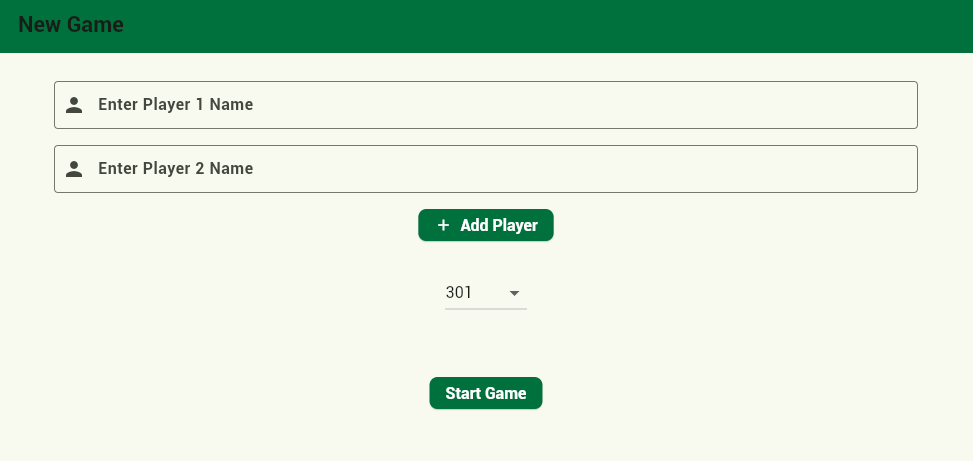

# Bullseye Buddy 🎯

Bullseye Buddy is a Flutter web app for tracking and analyzing your darts practice and games.  
[**Try the Web App**](https://bullseyebuddy-c0123.web.app)

---

## Features

- Interactive dartboard for score input
- Game and practice modes
- Statistics and performance tracking
- Mobile-friendly design

---

## App

<!-- Replace these with actual screenshots of your app -->
<p align="center">
  
  
</p>

---

## Getting Started

1. **Clone the repository:**
   ```bash
   git clone https://github.com/yourusername/bullseye_buddy.git
   cd bullseye_buddy
   ```

2. **Install dependencies:**
   ```bash
   flutter pub get
   ```

3. **Run the app locally:**
   ```bash
   flutter run -d chrome
   ```

---

## Contributing

Contributions are welcome! Please open an issue or submit a pull request.

---

## License

[MIT License](LICENSE)
